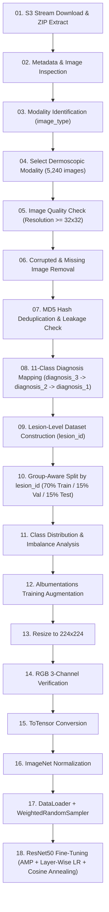

# ResNet50 Fine-Tuning on ISIC MILK10K Dataset (11-Class Lesion-Level Pipeline)

A complete, production-ready PyTorch pipeline for fine-tuning a pretrained **ResNet-50** on the official **ISIC MILK10K** dermoscopic skin lesion benchmark (`doi: 10.34970-648456`) in **Google Colab**.

---

## 📌 Project Overview

| Property | Detail |
|---|---|
| **Model** | ResNet50 (Pretrained on ImageNet-1K: `ResNet50_Weights.DEFAULT`) |
| **Dataset** | ISIC MILK10K (`10,480` total images: 5,240 dermoscopic & 5,240 clinical) |
| **Selected Modality** | Dermoscopic Only (`5,240` images across `5,240` unique lesions) |
| **Classification Task** | Official MILK10K 11-Class Diagnostic Benchmark |
| **Splitting Strategy** | **Lesion-Level** Stratified Split (`70% Train / 15% Val / 15% Test`) via `lesion_id` |
| **Frameworks** | PyTorch, Torchvision, Albumentations, Scikit-Learn |
| **Target Environment** | Google Colab (GPU: Tesla T4 / A100 / V100) |

---

## 🗂️ Official MILK10K 11-Class Diagnostic Schema

Unlike the legacy 7-class HAM10000 dataset, the official **ISIC MILK10K** benchmark groups granular histopathology and clinical diagnoses into **11 broad categories**:

| Code | Diagnosis Name | Pathological Category |
|---|---|---|
| **`NV`** | Melanocytic Nevi (Compound, Junctional, Spitz, Reed, Dysplastic, etc.) | Benign |
| **`MEL`** | Melanoma (In Situ, Superficial Spreading, Nodular, Lentigo Maligna) | Malignant |
| **`BKL`** | Benign Keratosis-like (Seborrheic Keratosis, Solar Lentigo, Lichenoid) | Benign |
| **`BCC`** | Basal Cell Carcinoma (Nodular, Superficial, Infiltrative, Morpheaform) | Malignant |
| **`AKIEC`** | Actinic Keratoses / Squamous Cell Carcinoma in Situ (Bowen's Disease) | Precancerous |
| **`SCCKA`** | Squamous Cell Carcinoma (Invasive) / Keratoacanthoma | Malignant |
| **`DF`** | Dermatofibroma (Fibrous Proliferations) | Benign |
| **`VASC`** | Vascular Lesions (Hemangioma, Pyogenic Granuloma, Angiokeratoma) | Benign |
| **`INF`** | Inflammatory Dermatoses (Psoriasis, Eczema, Lichen Planus, Dermatitis) | Benign / Non-Neoplastic |
| **`BEN_OTH`** | Benign Other (Epidermal Cyst, Scar, Fibrous Papule, Wart, Neurofibroma) | Benign |
| **`MAL_OTH`** | Malignant Other (Merkel Cell Carcinoma, Lymphoma, Adnexal Carcinoma) | Malignant |

---

## 🔁 Complete 18-Step Pipeline Workflow



---

## 🔑 Key Engineering & Medical Solutions

1. **Granular Hierarchical Diagnosis Mapping (Step 08)**:
   - Evaluates specific sub-types in `diagnosis_3` (e.g., *Squamous cell carcinoma, Invasive* $\to$ `SCCKA`, *Nevus, Reed* $\to$ `NV`).
   - Gracefully falls back to `diagnosis_2` and `diagnosis_1` for unclassified or rare lesions.
2. **Strict Lesion-Level Group Splitting (Step 10)**:
   - Uses Scikit-Learn `GroupShuffleSplit` on `lesion_id` to ensure paired images or multiple acquisitions from the same lesion **never leak** across Train, Validation, and Test sets.
   - Enforces zero-leakage assertions before model initialization.
3. **Imbalance Mitigation (Step 17 & 18)**:
   - Pairs a `WeightedRandomSampler` in the PyTorch `DataLoader` with class-weighted `CrossEntropyLoss` to handle severe class imbalances across rare malignancies (e.g., `MAL_OTH`, `SCCKA`).
4. **Differential Layer-Wise Learning Rates (Step 18)**:
   - Shallow feature extractors (`layer1`, `layer2`): `1e-5`
   - Mid/Deep representations (`layer3`, `layer4`): `5e-5` to `1e-4`
   - Classification Head (`fc`): `2e-4`

---

## 🚀 Quickstart in Google Colab

### 1. Install Dependencies
```python
!pip install -q torch torchvision albumentations pandas numpy scikit-learn matplotlib seaborn pillow requests tqdm
```

### 2. Run the Full Pipeline Script
Upload `resnet50_milk10k_full_pipeline.py` to Google Colab and execute:
```python
!python resnet50_milk10k_full_pipeline.py
```
*The script automatically handles dataset downloading from the ISIC S3 bucket, extraction, verification, training, and evaluation.*

---

## ⚙️ Hyperparameters & Training Setup

| Parameter | Configuration |
|---|---|
| **Input Dimensions** | $224 \times 224 \times 3$ (RGB) |
| **Batch Size** | `32` |
| **Epochs** | `10` |
| **Optimizer** | `Adam` ($\text{Weight Decay} = 10^{-4}$) |
| **Learning Rate Schedule** | `CosineAnnealingLR` ($T_{\text{max}}=10, \eta_{\text{min}}=10^{-6}$) |
| **Mixed Precision** | `torch.amp.autocast("cuda")` + `GradScaler` |
| **Classification Head** | `nn.Dropout(p=0.3)` $\to$ `nn.Linear(2048, 11)` |
| **Best Model Metric** | Highest Validation Macro One-vs-Rest AUC |

---

## 📊 Generated Output Artifacts (Saved to `/content/`)

| File Path | Description |
|---|---|
| `/content/best_resnet50_milk10k.pth` | Best model checkpoint saved during fine-tuning. |
| `/content/class_distribution.png` | 3-panel bar chart depicting class balance across Train/Val/Test splits. |
| `/content/augmented_samples.png` | Sample grid of $224 \times 224$ augmented dermoscopic images. |
| `/content/training_history.png` | Epoch-by-epoch loss, accuracy, Macro-F1, and Macro-AUC curves. |
| `/content/confusion_matrix.png` | Final $11 \times 11$ normalized test set confusion matrix. |

---

## 📁 Repository Structure

```
ResNet50 + MILK10/
├── resnet50_milk10k_full_pipeline.py   # Complete 18-step pipeline script
├── fine_tune_resnet50_colab.py         # Lightweight fine-tuning script
└── README.md                           # Project documentation and guide
```
